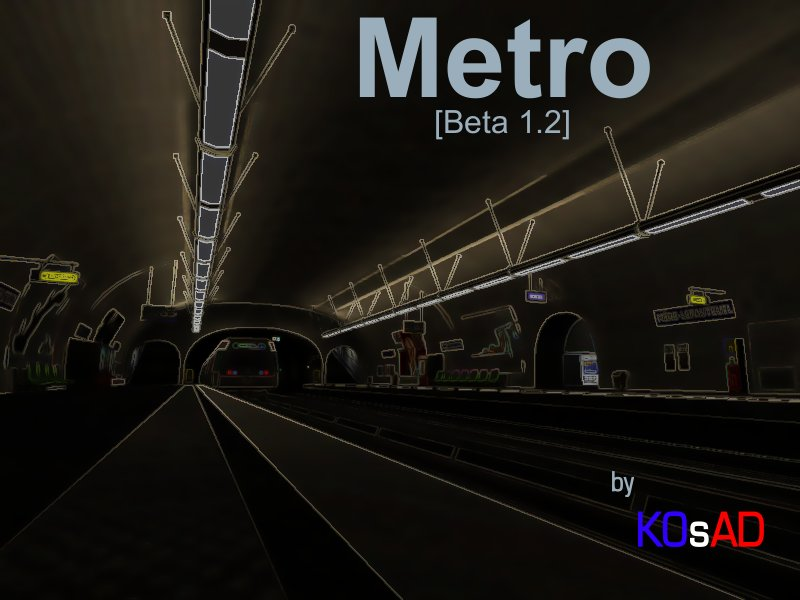

Métro
-----

This is a map ported from the [Tremulous](https://tremulous.net/) game to the [Unvanquished](https://unvanquished.net/) game. It features Paris undergrounds, including subway, sewers, crypt, catacombs and stone quarry.

This port is an Interstellar Oasis initiative: [https://github.com/InterstellarOasis/InterstellarOasis](https://github.com/InterstellarOasis/InterstellarOasis).

Levelshot
---------

Credits
-------

Unvanquished port:

* Thomas “illwieckz” Debesse <hidden mail="dev [ad] illwieckz.net"/> (http://gg.illwieckz.net)

Mapping, models, textures, shaders:

* KOsAD <hidden mail="kosad93 [ad] gmail.com"/> (http://kosad93.googlepages.com/metro.html)

Models:

* Mike “Vedacon” McInnerney

Textures, shaders:

* Randy “ydnar” Redding <hidden mail="ydnar [ad] shaderlab.com/"/> (http://www.shaderlab.com)
* berneyboy <hidden mail="berneyboy [ad] hotmail.com"/>
* Fabrice <hidden mail="fabo006 [ad] hotmail.com"/>
* noah <hidden mail="quachnoah [ad] hotmail.com"/>
* PkVintuitkat <hidden mail="pkvintuitkat [ad] wanadoo.fr"/>
* Jan “Stannum” Van der Weg (http://janvanderweg.com/)
* Robin “OverFlow” Marshall (http://bobbin.vilkacis.net)
* Simon “sock” O'Callaghan (http://www.simonoc.com/)
* Yves “evil lair” Allaire (http://evillair.net)
* Paul Bourke
* http://www.amazingtextures.com/
* http://www.grsites.com/archive/textures/
* http://www.imageafter.com/
* http://www.mayang.com/textures/
* http://www.noctua-graphics.de/english/freetex_e.htm
* http://www.turbosquid.com/
* texturewarehouse.com (closed)

Sounds:

* adllto (http://freesound.iua.upf.edu//)
* andriala (http://freesound.iua.upf.edu//)
* ashassin (http://freesound.iua.upf.edu//)
* billy_magnum (http://freesound.iua.upf.edu//)
* dobroide (http://freesound.iua.upf.edu//)
* emmanuel (http://freesound.iua.upf.edu//)
* Erdie (http://freesound.iua.upf.edu//)
* fractal_dimension (http://freesound.iua.upf.edu//)
* Halleck (http://freesound.iua.upf.edu//)
* homejrande (http://freesound.iua.upf.edu//)
* klangfabrik (http://freesound.iua.upf.edu//)
* kollege (http://freesound.iua.upf.edu//)
* Marec (http://freesound.iua.upf.edu//)
* mikehirst (http://freesound.iua.upf.edu//)
* randomroutine (http://freesound.iua.upf.edu//)
* reinsamba (http://freesound.iua.upf.edu//)
* thedapperdan (http://freesound.iua.upf.edu//)
* http://www.sound-fishing.net/bruitages.html

Special thanks:

* CH4NDL3R
* Greudin
* LordSquart
* Soubok
* Thorn
* Tuple
* ydnar
* tHc team
* Tremulous dev team

Legal
-----

Changes by Thomas Debesse fall under the Internet Systems Consortium License:  
http://directory.fsf.org/wiki/License:ISC

Original work by KOsAD (map, models, textures…) is placed under the Creative Commons Attribution-Noncommercial-Share Alike 2.0 France License.
https://creativecommons.org/licenses/by-nc-sa/2.0/fr/

History
-------

* 2007-12-03:	Metro beta 1.2
* 2007-09-03:	Metro beta 1.1
* 2007-04-04:	Metro beta 1
